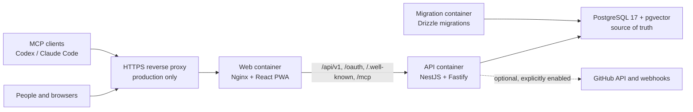
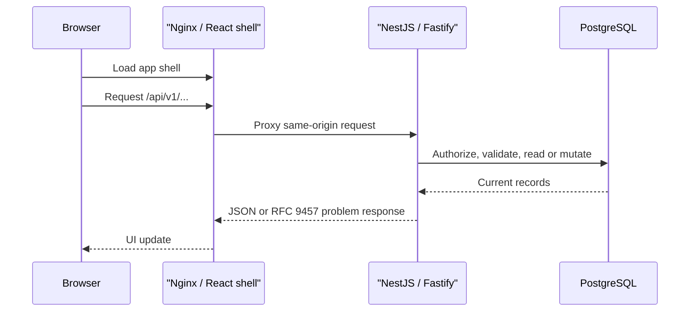
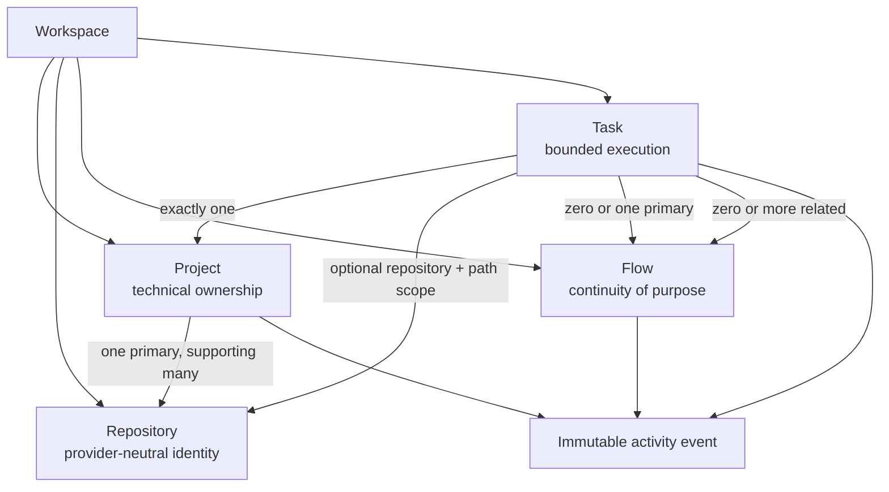

# Anklav architecture

Anklav is a single deployable application for managing software-development work. It is intentionally organised as one web application, one API, and one PostgreSQL database—not as a collection of independently deployed services.

This document explains how those parts fit together, what **self-hosted** means in practice, and which boundaries are local versus optional external connections.

For the product model of workspaces, projects, flows, and tasks, see [the original product brief](initial.md). For MCP-specific setup and permissions, see [MCP access](mcp.md).

## Self-hosted, in plain language

**Self-hosted means you run Anklav yourself, on infrastructure you control.** There is no Anklav-operated cloud account or vendor-hosted Anklav database in the normal deployment.

You choose where it runs:

- a laptop for local use;
- a home server or NAS;
- a virtual private server; or
- your company’s own cloud account and network.

The users, tasks, comments, OAuth grants, and optional integration settings are stored in the PostgreSQL database that accompanies *your* deployment. You control who can reach the application, how long data is retained, and how database backups are made.

Self-hosting does not mean that the server can never make an outbound connection. Anklav may contact GitHub only when the optional GitHub integration is enabled, and an MCP client connects to Anklav only after a user authorizes it. Those are deliberate, configured connections—not a hidden dependency on an Anklav cloud service.

## System map

For local development, the reverse-proxy box is not required: Docker Compose exposes the web container on port `8080`. The web container proxies API, OAuth, discovery, and MCP paths to the internal API container. PostgreSQL is not published to the host by the supplied Compose file.

## Runtime components

| Component | Responsibility | Publicly exposed? |
| --- | --- | --- |
| `apps/web` | React/Vite control-room UI, PWA manifest, cached static shell, and same-origin browser requests. | Yes, through the web container. |
| `apps/api` | NestJS/Fastify REST API, authentication, domain rules, OpenAPI, OAuth, MCP, and optional GitHub integration. | Only indirectly through the web proxy in Compose. |
| `apps/mcp` | Optional local stdio bridge for MCP hosts that cannot use the remote HTTP endpoint. | No; this is a locally run command-line program. |
| PostgreSQL + pgvector | Durable source of truth for user accounts, work records, repository identities, grants, integrations, event streams, and future vector-backed retrieval. | No, internal Compose network only. |
| `migrate` service | Applies Drizzle migrations before the API starts. | No. It exits after migration. |
| `packages/api-client` | Generated TypeScript API contract consumed by clients and tooling. | Not a runtime service. |

The Docker Compose definition is the local, single-machine topology. It starts PostgreSQL, waits for it to become healthy, runs migrations once, starts the API, and exposes the web container at `http://localhost:8080`.

## Request and data flow

The browser never talks directly to PostgreSQL. It uses the API under `/api/v1`; OpenAPI documentation is served at `/api/docs`.

The PWA caches static application files so the shell can load without a connection. It does **not** promise offline reads, mutations, or background synchronization. When the network is unavailable, the UI shows an offline notice instead of pretending work changes have been saved.

## Core work model and persistence

The database is the source of truth. Tasks use an immutable, idempotent domain-event stream with a rebuildable current-state projection. Other project, flow, relation, and comment tables currently store their authoritative current record. Meaningful mutations also append immutable activity records.

Important correctness boundaries live in the API and database schema:

- Records are scoped to a workspace; permissions use workspace memberships and roles.
- Projects own the technical home of a task. Flows can span projects and are linked through tasks.
- Repository identity is workspace-scoped and provider-neutral. GitHub installations and machine-local checkout paths are mappings or aliases, never identity.
- Task contracts explicitly capture objective, constraints, risk, expected artifacts, repository/branch/path scope, context policy, memory mode, approvals, and coordination ownership.
- Every task command records an idempotency key and ordered domain event; direct workflow-state projection changes are rejected by PostgreSQL.
- Task and flow workflow states are configurable per workspace but retain a stable semantic category.
- Mutations of versioned records require `If-Match`; stale writes return `412 Precondition Failed` with the current record.
- Task and flow relations reject self-links, duplicates, hierarchy cycles, and blocking cycles where applicable.
- Deletes are soft deletes. Recovery is available from the workspace trash; activity is never purged by normal APIs.
- PostgreSQL rejects updates and deletes of activity rows.

The change feed is built from activity sequence numbers. Clients poll it and retain a cursor, leaving a clean path to add server-sent events later without changing domain mutations.

## Authentication and access boundaries

Anklav uses local accounts rather than an external identity provider for the core application:

- The very first administrator is created with `ANKLAV_SETUP_TOKEN`; setup closes permanently after that.
- Passwords use Argon2id hashes.
- Browser sessions are database-backed, hashed, HTTP-only cookies with CSRF protection.
- Instance administrators manage global accounts. Workspace membership roles are `owner`, `admin`, and `member`.
- Owner protection prevents removing the last active workspace owner.

In production, the browser-facing origin must be HTTPS. A TLS reverse proxy forwards requests to the web container and preserves `Host` and `X-Forwarded-Proto`. Set `APP_ORIGIN` to that exact external origin. The supplied local Compose configuration uses `COOKIE_SECURE=false`; production must override it to `true` after HTTPS is in place.

## Optional external boundaries

### MCP

The remote MCP endpoint is `/mcp`. It is protected by Anklav’s OAuth authorization server with dynamic client registration, authorization-code flow with PKCE, opaque access tokens, rotating refresh tokens, scopes, and per-workspace consent. A user can review and revoke connected clients.

MCP is an access boundary, not an autonomous-agent runner: Anklav does not execute Codex or Claude Code itself. Connected clients operate only through the explicit tool surface and the workspaces granted during consent. See [MCP access](mcp.md) for setup and the excluded operations.

### Provider-native sessions

A native Claude or Codex session is a durable identity attached to one execution attempt. Provider adapters read their own bundle, rollout, or app-server source without modifying it, then push versioned ingestion batches through HTTP or MCP. Each batch records its parser version, source revision, cursor range, manifest, path mappings, and parse errors; idempotency keys and stable provider sequences prevent a revision from being silently rewritten.

Anklav stores normalized turns and typed items without flattening tool/result, command/output, approval/response, patch/base, subagent/result, or compaction relationships. Searchable item content is explicitly redacted and hash-addressed. The untouched provider archive is stored separately as exact evidence, linked to the session, and read only through the evidence access boundary. Context packs include session provenance and resumability metadata, but never include transcript content implicitly.

### Derived hybrid retrieval

Retrieval documents are a rebuildable projection, never canonical memory. A project refresh derives semantic units from current tasks, verified and superseded claims, accepted and superseded decisions, checkpoints, terminal run summaries, verified canonical knowledge, explicitly redacted evidence previews, and safe or redacted native-session episodes. Unreviewed evidence and session content never enter the index.

Every search requires an explicit project boundary after workspace membership is checked. Optional task scope is validated inside that project and may expand one hop through explicit task relationships. Current-state searches suppress superseded material; historical intent or an explicit historical flag can include it. Results are reranked from lexical relevance, vector similarity, source authority, task affinity, and recency, with the chosen weights and result references persisted in a retrieval trace. The original query is represented only by its SHA-256 hash in that trace.

PostgreSQL full-text search uses the `simple` dictionary to preserve identifiers, paths, hashes, and error tokens. pgvector stores 768-dimensional embeddings behind a model name and the exact retrieval-document content hash. An external embedding worker may list missing documents and attach embeddings; stale embeddings are excluded automatically when document content changes. Anklav does not call a hosted embedding model or make a particular model provider canonical.

### GitHub

GitHub is disabled by default with `GITHUB_INTEGRATION_ENABLED=false`. When enabled, workspace administrators can create and install a dedicated GitHub App, map repositories to projects, and use the GitHub API and signed webhooks. Integration secrets are encrypted using the configured `INTEGRATION_ENCRYPTION_KEY`.

This boundary requires a public HTTPS `PUBLIC_BASE_URL`, because GitHub must reach callback and webhook URLs. It is not needed for local task management. Repository data and diffs are fetched on demand rather than being retained as a general repository mirror.

## Deployment choices

### Local or single-machine use

Docker Compose is enough. It runs all stateful services on the one machine and stores PostgreSQL data in the named `anklav-postgres` volume. Opening `http://localhost:8080` is appropriate for a local installation.

If the machine is on a shared network, remember that the current port mapping is `0.0.0.0:8080`. Restrict it with a Compose override or host firewall if it should be reachable only from the machine itself.

### Public production use

Put an HTTPS-capable reverse proxy such as Caddy, Traefik, or Nginx in front of the web container. The proxy should be the only public entry point; PostgreSQL and the API container remain private on the Compose network.

Production responsibilities belong to the operator:

1. Use a domain name and valid TLS certificate.
2. Set strong, unique `POSTGRES_PASSWORD`, `ANKLAV_SETUP_TOKEN`, and `SESSION_SECRET` values.
3. Set `APP_ORIGIN` and, if GitHub is enabled, `PUBLIC_BASE_URL` to the canonical HTTPS URL.
4. Enable secure cookies and restrict inbound access to the web proxy.
5. Back up the PostgreSQL volume and test restoration. The application does not yet provide automated backup or export.
6. Keep Docker images and the host operating system updated.

## Scope and Boundaries

The architecture is deliberately small: one database and one API process coordinate the core rather than a microservice fleet. The PostgreSQL image includes pgvector 0.8.1; derived full-text/vector retrieval runs in PostgreSQL and accepts content-hash-guarded embeddings from an external worker. The current application does not yet generate embeddings itself, provide a commit-aware code-symbol index, perform broad GraphRAG-style synthesis, automatically generate tasks, run generic workflow automation, provide analytics, operate distributed workers, or mirror repositories generally.

The optional MCP and GitHub paths are explicit extensions with their own permission and configuration boundaries. Native-session ingestion preserves provider history for inspection and continuation; it does not recreate, edit, or live-synchronize provider sessions. Raw agent output never becomes canonical project knowledge automatically, and these integrations do not replace normal task, flow, human-review, or activity-history rules.

## Related documents

- [README](../README.md) — setup, command overview, and deployment entry points.
- [Original product brief](initial.md) — the domain rationale and longer-term direction.
- [MCP access](mcp.md) — remote MCP and stdio bridge setup.
